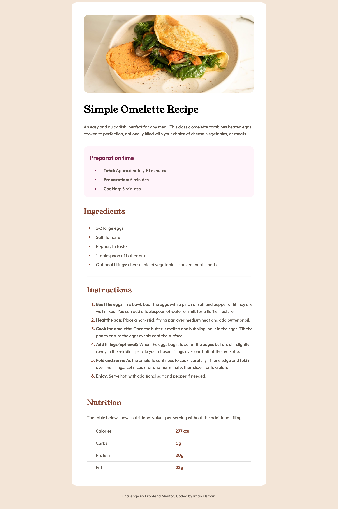

# Frontend Mentor - Recipe page solution

This is a solution to the [Recipe page challenge on Frontend Mentor](https://www.frontendmentor.io/challenges/recipe-page-KiTsR8QQKm).

## Table of contents

- [Overview](#overview)
- [The task](#the-task)
- [Approach](#approach)
- [Outcome](#outcome)
- [Built with](#built-with)
- [Feedback](#feedback)
- [Lessons](#lessons)
- [Take forward](#take-forward)

## Overview

This challenge was for a recipe page, for both desktop and mobile.

## The task

Most notably, it contains a table and line breaks. I had to break the task down piece by piece and work top to bottom on the CSS to reach the desired outcome.

## Approach

I was a little overwhelmed with the amount of content for this challenge, but as I’ve been taught, I broke it down into pieces working from the top down. This made it a lot easier and I didn’t move on until a piece was resolved.

## Outcome

I’m pleased with the outcome as I didn’t know I could make something as detailed as this at this point in my learning. I was a little overwhelmed with the prospect of styling for mobile as the design changes a bit. But once I got started, I moved through the media queries with relative ease.

:jigsaw: Live Site URL: (https://i000o.github.io/fem-recipe-page/)  
:pencil2: Solution URL: (https://www.frontendmentor.io/solutions/recipe-page-desktop-and-mobile-bs0KbnEwYd)

## Feedback

Again, I received positive feedback for my design eye in this case. I think the sizing is a little off, but I can amend this once I understand it better. Other than that, I haven’t had any significant critique of this solution but I will add it here if anyone contributes.

_“Awesome solution.Everything is made exactly the way on the design.Great job!”_

Source: https://www.frontendmentor.io/solutions/recipe-page-desktop-and-mobile-bs0KbnEwYd

## Built with

:gear: Semantic HTML5 markup  
:gear: CSS Flex  
:gear: Desktop-first workflow

## Lessons

1. HTML tables - I’d never coded these before. I learnt about `th`, `tr`, `td` properties and how to add cell borders (and remove them). It was challenging to use `padding` on cells as it offsets the table, but I adjusted to this. I’d like more practice with tables, though.
2. Page breaks - Using the `hr` HTML property to draw line breaks in the page; styling these, adding margins etc. This was really useful to know.
3. I’m good at spotting how to structure HTML content, down to strong elements etc. This helps me to do a lot of the early work at the start so the styling is not such a heavy task when I begin.
4. I’m feeling more comfortable with styling lists, down to the markers and the spacing.
5. First time using `::marker` pseudo-element for list-styles.

## Take forward

:grey_exclamation: HTML tables  
:grey_exclamation: `hr` line breaks
:grey_exclamation: You don’t need to be intimidated by larger amounts of content
:grey_exclamation: You’re better at media queries than you think
